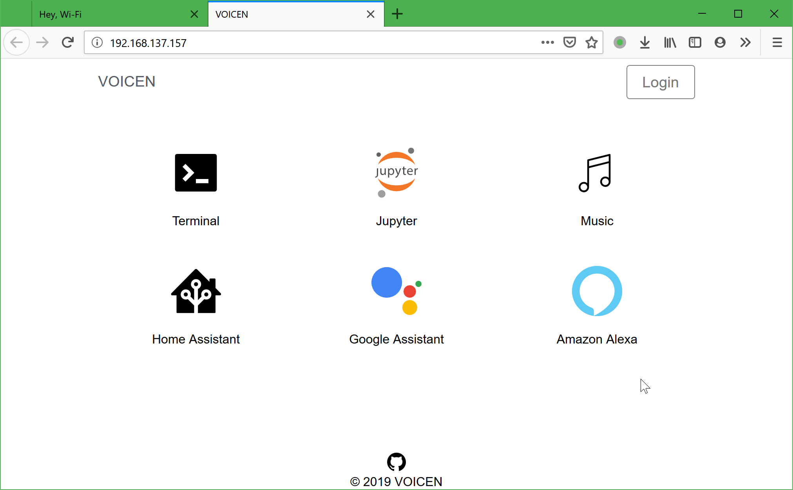
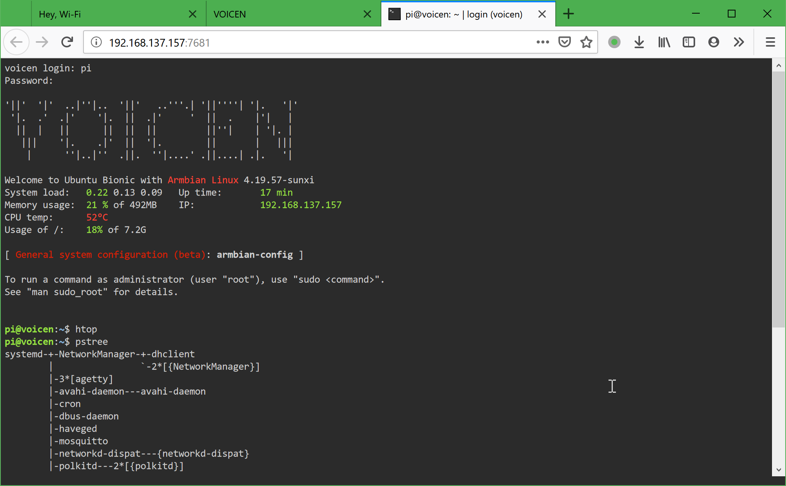
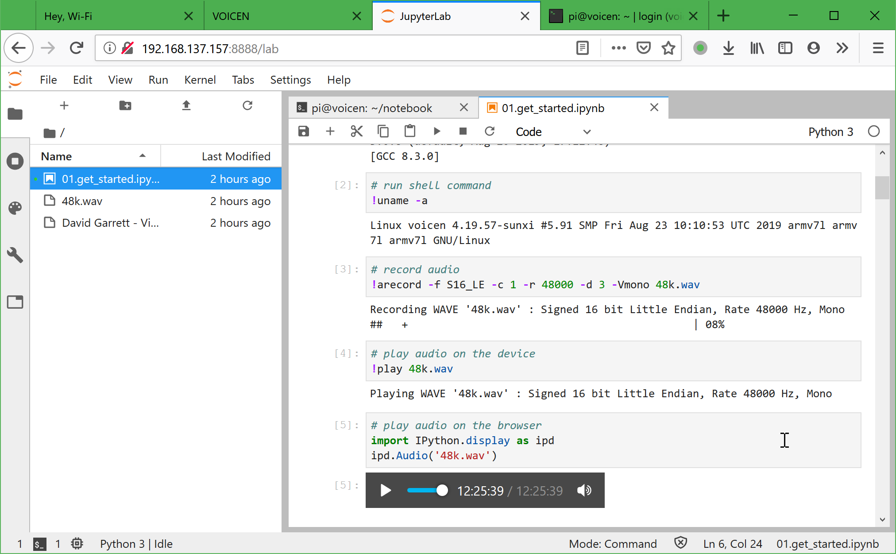

# Get Started

## Prepare a micro SD card

## Setup WiFi

<iframe width="560" height="315" src="https://www.youtube.com/embed/mDg0haANwbM" frameborder="0" allow="accelerometer; autoplay; encrypted-media; gyroscope; picture-in-picture" allowfullscreen></iframe>

1.  Press and hold the touch key for more than 4 seconds to turn the device into WiFi setup mode.
2.  Go to the web app - [Hey WiFi](https://voice-engine.github.io/hey-wifi) to broadcast WiFi settings over sound.
3.  After the device received the WiFi settings and connected to the WiFi network, it sends its IP address to the web app, and then the web app generates a link which is linked to the device dashboard.
4.  Click the link with the device's IP address, we will get the dashboard of the device.

## Device Dashboard

## Add a New User Using Web Terminal

We can open a web terminal to add a new user. The default user is `root` and its password is `1234`.
After a new user is created, the user `root` will be no longer allowed to login the web terminal.

## Play with Jupyter Lab

We can also open JupyterLab which is a very powerful web IDE. It allows you to create and share documents that contain live code, equations, visualizations and narrative text. In this document, you can run python or shell scripts to play sound, plot graph and analyze data.