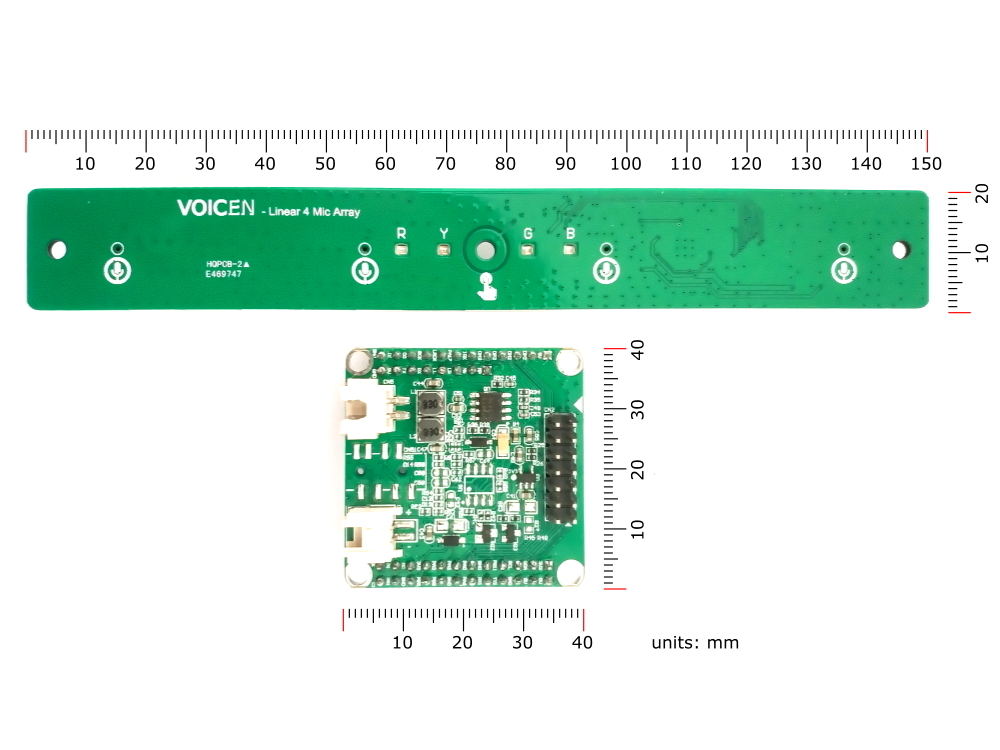

# Hardware

## VOICEN Linear 4 Mic Array Kit

The kit lets you build a smart speaker from scratch. It can run a variety of voice assistants such as Amazon Alexa, Google Assistant, MyCroft,  Snips Offline Voice Assistant and Baidu DuerOS. It supports AirPlay and UPnP/DLNA. You can turn it into a music box with Mopidy and MPD, or use it to automate your home with HomeAssistant.

### Specifications
+ AllWinner H3 (Quad-Core ARM Cortex A7 @ 1.296 GHz)
+ 512MB RAM
+ 8GB eMMC Flash
+ 16GB Micro SD Card
+ 4 Channels ADC AC108
+ 4 MEMS microphones (64dB SNR, -38dB Sensitivity)
+ 4Ω 3W Loud Speaker
+ 4 LEDs (RGBY)
+ 1 Touch Key
+ 1 Paper Case
+ 1 Micro USB Cable

